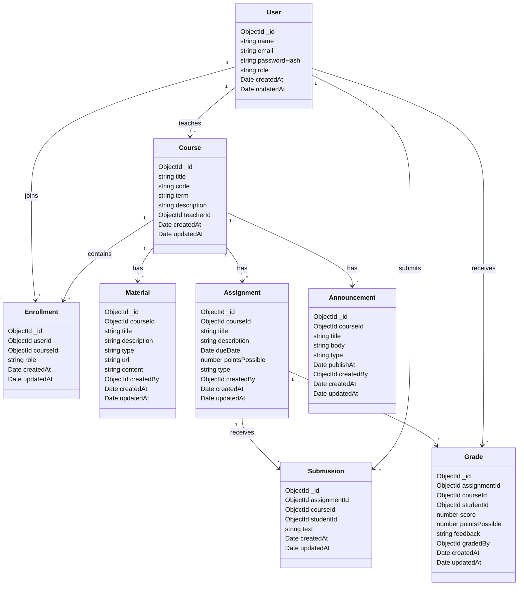

# Data Model Diagrams

## Entity Overview

The Fabric data model centers on users, courses, enrollments, course content, coursework, and grading.

## Diagram Asset

- Existing image diagram: [`Untitled-1.png`](../Untitled-1.png)

## Mermaid Class Diagram

## Relationship Summary

- A teacher owns many courses.
- Students join courses through enrollments.
- Courses contain materials, assignments, and announcements.
- Assignments can receive submissions and grades.
- Grades connect a student to an assignment within a course.
